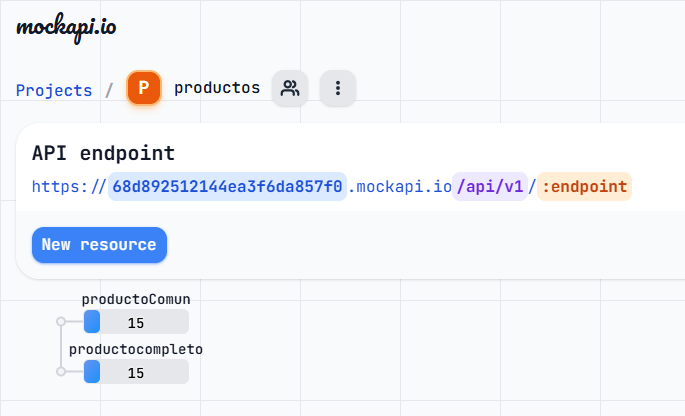

# Ejercicio Práctico Nº 5

**Descripción de tu tarea:**

Tu próximo objetivo será conectar la aplicación a una API que provea información sobre los productos. Deberás mostrar los datos en tiempo real, manejar estados de carga y errores, y continuar utilizando un diseño atractivo para el eCommerce.

**Requisitos del Proyecto:**

***Integración con una API:***
**Nota: Completado, app conectada con la ***[Mi-API](https://68d892512144ea3f6da857f0.mockapi.io/api/v1/ProductoComun)*****

**MockAPI** te permite crear un sólo proyecto gratis, pero varias APIS en un mismo proytecto  



***Para utilizar cada API sólo debemos cambiar el :endpoint***

ejemplos con mis APIS:

***[API productoComun :](https://68d892512144ea3f6da857f0.mockapi.io/api/v1/productoComun)***
La URL en éste caso sería : ``https://68d892512144ea3f6da857f0.mockapi.io/api/v1/productoComun``


***[API productocompleto :](https://68d892512144ea3f6da857f0.mockapi.io/api/v1/productocompleto)***
La URL en éste caso sería : ``https://68d892512144ea3f6da857f0.mockapi.io/api/v1/productocompleto``
 
*OJO: la dirección respeta mayúculas y minúsculas, fijense bien el nombre que le pusieron y copienlo excato o no les va a funcionar... me pasó y pense que la habia cagado... 😂

**Gestión del estado con useState:**

Almacena los productos obtenidos de la API en un estado local.  
Usa otro estado para gestionar si la aplicación está en proceso de carga.  

**Manejo de efectos secundarios con useEffect:**

Realiza la petición a la API cuando el componente principal de productos se monte.  
Gestiona posibles errores y muestra un mensaje adecuado si ocurre algún problema.  

***Estado de carga y errores:***

Mientras los productos están cargando, muestra un mensaje o un spinner con "Cargando productos...".  
Si ocurre un error, muestra un mensaje como: "Error al cargar productos. Inténtalo más tarde."  

**FLUJO ACTUAL DE MI APP**  
😎Esquema del flujo actual de tu app:

```
App.jsx
│
├─ BrowserRouter
│   │
│   └─ CartProvider (todo tiene acceso al carrito - context)
│       │
│       └─ LoadingState (cargando / error)
│           │
│           └─ <div>
│               │
│               ├─ Navigation  ← usa useCart() para mostrar cantidad
│               │
│               ├─ Routes
│               │   ├─ "/"          → HomePage
│               │   ├─ "/productos" → ProductosPage (recibe productos del hook)
│               │   └─ "/contacto"  → ContactoPage
│               │
│               ├─ Cart         ← modal/offcanvas, usa useCart()
│               │
│               └─ Footer
│
└─ useFetchProductos()  ← hook llamado desde App.jsx
      │
      ├─ retorna { productos, cargando, error }
      └─ ProductosPage recibe `productos` como prop
```

**Flujo resumido:**

1. `App.jsx` inicializa **router + contexto del carrito**.
2. `useFetchProductos` trae los productos y maneja estado `cargando`/`error`.
3. `ManejoDeCarga` decide si mostrar loading, error o el contenido.
4. `Navigation`, `Routes`, `Cart` y `Footer` se renderizan dentro del layout principal.
5. `ProductosPage` recibe productos como prop, mientras que `Cart` y `Navigation` consumen datos del carrito desde el contexto.

💡 Nota: Todo está **bien desacoplado**: fetch, carrito y UI están separados, así que escalar la app o cambiar algo será mucho más fácil.

**Actualizar el diseño del eCommerce:**

Crea una sección de productos dinámicos que se cargue dede la API.  
Asegúrate de mantener el diseño atractivo y responsivo.

Se agregaron/actualizaron a la App las siguientes pàginas:

**Home:** con boton de oferta.  
**Tienda:** corresponde a la lista de productos.  
**Contacto:** se actualizo contacto para que sea un poco màs amigable.  
**Carrito:** se mantuvo igual pero se agregaron tooltips y Popups Globales para mensajes al usuario.  

***Ampliación del carrito:***

Permite agregar al carrito productos que ahora se obtendrán desde la API.  
Si el carrito está vacío, muestra el mensaje "El carrito está vacío", como en el ejercicio anterior.  

El Carrito permite agregar los productos desde la API, y es un offcanvas/Bootstrap, tambien permite agregar cantidad o eliminar productos, ademàs podemos ver el Carrito sin productos, Vacìo.

***Estructura***

Continuar con el proyecto de la clase anterior, agregando nueva funcionalidad.  

En èste caso la estructura se agrando un poco, ya que al agregar la Api, cree 4 Archivos para el manejo del contexto.
varios para el manejo de mensajes y errores, y la conexion con la API fetch, además de mis propios componentes.

Aquì detallo la estructura del proyecto:

```
src
│
├─ assets   (archivos de imàgenes)
├─ components   (Componentes)
│   ├─  Cart.jsx (Carrito compras OFFCANVAS)
│   ├─  contact.jsx (componente de Contacto)
│   ├─  footer.jsx (componente de pie de pàgina)
│   ├─  footer.css (estilo de pie de pàgina)
│   ├─  Home.jsx (componente de Home)
│   ├─  Home.css (estilo de Home)
│   ├─  LoadingState.jsx (componente de Carga y errores )
│   ├─  LoadingState.jsx (estilos de Carga y errores )
│   ├─  MiBanner.jsx (mi Banner que se muestra arriba en todas las páginas)
│   ├─  MiBanner.jsx (estilo de mi Banner )
│   ├─  MiBoton.jsx (mi componente Boton )
│   ├─  MiBoton.css (estilo de mi Boton )
│   ├─  Nav.jsx (componente Navegador )
│   ├─  Nav.css (estilo Navegador )
│   ├─  PopupMensaje.jsx (componente que recibe mensaje, se muestra/desaparece solo.)
│   ├─  PopupMensaje.css (estilo del componente visual)
│   ├─  ProductCard.jsx (componente de tarjeta de Producto)
│   ├─  ProductCard.css (estilos de tarjeta de Producto)
│   └─  ProductList.jsx (componente administrador de tarjeta de Producto)
├─ Context
│   ├─  CartContext.js (exporta solo CartContext)
│   └─  CartProvider.jsx (envuelve la app y da el context)
├─ hooks
│   ├─  DBProduct.json (Base de datos exportada a la API)
│   ├─  imagenesurl.md (Base de datos imagenes exportada a la API)
│   ├─  useCart.jsx (hook con la lógica del carrito (estado, funciones))
│   ├─  useCartContext.jsx (hook para consumir el context desde cualquier componente)
│   └─  useFetchProduct.jsx (Conexion con la API, devuelve productos, error, cargando)
├─ pages
│   ├─  ContactoPage.jsx (página de contacto)
│   ├─  HomePage.jsx (página de inicio)
│   └─  ProductosPage.jsx (la tienda)│
├─ App.jsx   (archivo principal de la App)
├─ App.css   (Los estilos de la app, Globales)
├─ detallesDelEjercicio.md   (Èste archivo)
├─ main.jsx   (el main)
├─ MiBotonConTooltip.css   (los tooltip)
├─ index.html   (Pàgina)
└─ README.md    (Consigna)

     
```

**Componentes**

Mantener componentes organizados y reutilizables.

***Lista de coponentes reutilizables:***  

```
 components   (Componentes)
  ├─  footer.jsx (componente de pie de pàgina)
  ├─  footer.css (estilo de pie de pàgina)
  ├─  LoadingState.jsx (componente de Carga y errores )
  ├─  LoadingState.jsx (estilos de Carga y errores )
  ├─  MiBanner.jsx (mi Banner que se muestra arriba en todas las páginas)
  ├─  MiBanner.jsx (estilo de mi Banner )
  ├─  MiBoton.jsx (mi componente Boton )
  ├─  MiBoton.css (estilo de mi Boton )
  ├─  PopupMensaje.jsx (componente que recibe mensaje, se muestra/desaparece solo.)
  ├─  PopupMensaje.css (estilo del componente visual)

 Context
  ├─  CartContext.js (exporta solo CartContext)
  └─  CartProvider.jsx (envuelve la app y da el context)
 hooks
  ├─  useCart.jsx (hook con la lógica del carrito (estado, funciones))
  ├─  useCartContext.jsx (hook para consumir el context desde cualquier componente)
  └─  useFetchProduct.jsx (Conexion con la API, devuelve productos, error, cargando)

  ```

  ***Nota:** en realidad casi todos son reutilizables, aunque los que borre, estan personalizados se pueden adaptar a otros fines y reutilizar.

  **Código limpio**

Evitar redundancias y organizar estados y efectos claramente.

Al principio hice todo desde APP.JSX, pero me di cuenta de que necesitaba delegar responsabilidades, puesto que cada componente y archivo tiene su responsabilidad, por ejemplo, no se debería poner css dentro de un archivo ```*.jsx```, ya que esa no es su responsabilidad, por lo que, si necesito un estilo para un archivo, separo estilo ```*.css``` del archivo ```*.jsx``` , en mi caso preferí poner el estilo en la misma carpeta, con el mismo nombre asi es fácil de encontrar y modificar sin problemas. (no se si es una buena práctica, pero me resulta muy cómodo)   

***🧩 Estructura del carrito y por qué está separada***

El contexto del carrito se dividió en 4 archivos para mantener el código ordenado y evitar errores como "no se exporta useCart" o "el contexto es undefined", que aparecían cuando todo estaba en un solo archivo.

CartContext.js → crea el contexto y maneja el estado global.  
CartProvider.jsx → envuelve la app y provee el contexto.  
useCartContext.jsx → hook para acceder fácil al contexto sin repetir useContext.  
useCart.jsx → funciones auxiliares (por ejemplo, calcular totales) separadas de la lógica del contexto.  
👉 También se separó para evitar el prop drilling, que pasa cuando hay que pasar muchas props de un componente a otro.
Con el contexto, todos los componentes pueden usar el carrito sin necesidad de repetir props.

**Diseño**

Usar [**Bootswatch**](https://bootswatch.com/) o alternativa para mantener un diseño profesional.

Personalmente no me gusto ninguno, pero bueno hay plantilla abajo que no estan tan mal, el problema es que tu pagina debe estar totalmente hecha con bootstrap, cosa que me cuesta horrores, porque me gusta dar mi toque...🤷‍♀️

Instalarlo es tan sencillo como, descargar el CSS del tema y reemplazar el que viene con Bootstrap. 
En React: Se instala como paquete a través de npm 

```bash
npm install bootswatch

```

Cuando lo instales te puede salir algún mensaje, te explico lo que quiere decir:

✅ “added 47 packages” → Instaló correctamente Bootswatch y sus dependencias.  
⚠️ “1 moderate severity vulnerability” → Hay una pequeña vulnerabilidad en alguno de los paquetes (no es grave).  
💸 “35 packages are looking for funding” → Solo te avisa que algunos paquetes aceptan donaciones, podés ignorarlo.   

Si querés dejar todo limpio, ejecutá esto en la consola:  

```bash
npm audit fix

```

Eso intenta corregir automáticamente cualquier vulnerabilidad menor.
Después de eso ya podés usar Bootswatch sin problema 😄

```bash
import React from 'react';
import logo from './logo.svg';
import 'bootswatch/dist/slate/bootstrap.min.css'; // Added this :boom:
import './App.css';

function App() {
...

```
Si ya tenés Bootstrap importado en main.jsx, no hace falta tener dos imports, porque Bootswatch ya incluye Bootstrap dentro del tema.

Entonces, hacé esto:

Borrá el import de Bootstrap que tenés en main.jsx, o comentá esa línea (la que dice algo como import 'bootstrap/dist/css/bootstrap.min.css').

Agregá el tema de Bootswatch (por ejemplo Slate) en su lugar, así:

// main.jsx
import 'bootswatch/dist/Slate/bootstrap.min.css'


De esa forma, todo tu proyecto usará el estilo de ese tema.

👉 Importante: si lo dejás en App.jsx, también funciona, pero lo ideal es tenerlo en main.jsx para que afecte toda la app desde el inicio.

te dejo el CDN también:
También puedes usar los temas a través de CDN en jsDelivr https://www.jsdelivr.com/package/npm/bootswatch

# Glosario: 

## MockAPI

1. ¿Qué es MockAPI?  
MockAPI es una herramienta online gratuita que te permite crear una API falsa (mock) para practicar o probar tus aplicaciones sin tener todavía un servidor real.  

👉 **En pocas palabras:**
Es como una API de mentira, que simula datos reales (usuarios, productos, comentarios, etc.) para que puedas hacer pruebas con fetch, axios, o cualquier librería de conexión.  

2. ¿Para qué sirve?  
Sirve para:  
Probar peticiones GET, POST, PUT, DELETE (como si fuera una API real).  
Desarrollar tu frontend mientras el backend aún no existe.  
Practicar con frameworks como React, Vue o Angular.  
Testear integraciones o practicar con JSON.  

## 🚀 Cómo usarla paso a paso

*Entrar a la web:*

👉 [https://mockapi.io](https://mockapi.io)

***Crear una cuenta (opcional, pero recomendable):***  

Te permite guardar tus proyectos.  

***Crear un nuevo proyecto (API):  ***

Clic en “Create new project”.  

***Ponle un nombre (por ejemplo: UsuariosApp).***

Se genera una URL base, algo así como:

👉 `https://668b3d4aef1234.mockapi.io`


***Agregar recursos (endpoints):***

Clic en “New resource”.

Ejemplo: users

MockAPI te crea datos falsos automáticamente, algo como:

```bash
[
  {
    "id": "1",
    "name": "Juan Pérez",
    "email": "juan@example.com"
  }
]

```

***Probar las peticiones:***  
Podés usar herramientas como:

Postman  
Thunder Client (VSCode)  
O desde tu código con fetch:

```bash
fetch("https://668b3d4aef1234.mockapi.io/users")
  .then(res => res.json())
  .then(data => console.log(data))

```

***Podés agregar, editar o borrar datos:***

GET → obtener datos  
POST → agregar  
PUT o PATCH → modificar  
DELETE → eliminar  


<hr>

## Bootswatch

1. ¿Qué es Bootswatch? (Definición simple)  
Imagina que estás construyendo una casa (tu página web) y usas un kit de construcción estandarizado y muy popular llamado Bootstrap.  

Bootstrap te da todos los bloques listos para usar (botones, barras de navegación, formularios, etc.), pero todos tienen la misma apariencia: el color azul, bordes redondos, tipografía estándar, etc. Es muy funcional, pero visualmente un poco simple y repetitivo.  

Bootswatch es una colección de temas o pieles (skins) gratuitos para Bootstrap.  

Piensa en Bootswatch como una capa de pintura y estilo que se aplica a tu kit de construcción (Bootstrap). De repente, todos tus botones, barras de navegación y formularios cambian de color, forma y tipografía, dándole a tu web un look completamente diferente (más elegante, más oscuro, estilo cómic, etc.) sin que tengas que cambiar el código HTML.  

*En resumen:* Es una forma súper fácil y rápida de cambiar la apariencia visual de una página web que usa Bootstrap.  

2. ¿Para qué sirve?  

**Bootswatch tiene dos propósitos principales:**  

Ahorrar tiempo: Sirve para darle a tu página web un diseño visualmente atractivo y diferente al estándar de Bootstrap en segundos, sin necesidad de pasar horas escribiendo código CSS (el lenguaje que da estilo a la web).  

Personalización sencilla: Te permite elegir entre más de 20 estilos predefinidos (como "Darkly", "Flatly", "Superhero" o "Sketchy") para que tu proyecto se vea único.  

3. Modo de Uso (¿Cómo se aplica?)

La belleza de Bootswatch es su sencillez. Se instala reemplazando un solo archivo.  

***Paso 1:*** Tu página web ya debe estar usando Bootstrap.  
Para usar Bootswatch, primero debes tener una página web que ya use la estructura y las clases de Bootstrap. Por ejemplo, si tienes un botón, debe tener las clases de Bootstrap como `<button class="btn btn-primary">`.

***Paso 2:*** Elegir y descargar el tema de Bootswatch.  
Vas a la página oficial de Bootswatch.  
Exploras los diferentes temas y eliges el que más te guste (por ejemplo, el tema "Flatly").  
Cada tema tiene un archivo CSS (el archivo de estilos). En el tema que elijas, simplemente descargas el archivo llamado bootstrap.min.css (o similar) o copias el enlace (URL) a ese archivo.  

***Paso 3:*** Reemplazar el archivo de estilos de Bootstrap.  
Una página web que usa Bootstrap tiene un enlace a un archivo de estilos que se ve algo así en el código HTML:  

```html
<link rel="stylesheet" href="ruta/al/bootstrap.min.css">

```  

Para aplicar el tema de Bootswatch, simplemente reemplazas esa línea con el archivo (o el enlace) del tema de Bootswatch que descargaste.  

Ejemplo con un enlace CDN (el más fácil):  

Si tu página originalmente tenía el tema por defecto:  

```html
<link rel="stylesheet" href="https://cdn.jsdelivr.net/npm/bootstrap@5.3.3/dist/css/bootstrap.min.css">

```
Para cambiar al tema "Darkly" (un tema oscuro) de Bootswatch, solo cambias la URL:   

```html
<link rel="stylesheet" href="https://cdn.jsdelivr.net/npm/bootswatch@5.3.3/dist/darkly/bootstrap.min.css">

```

¡Y eso es todo! Al recargar tu página, todos los componentes de Bootstrap (botones, menús, alertas) que ya tenías se transformarán automáticamente al nuevo estilo. No necesitas tocar ni una sola línea de tu código HTML o de tus propias clases CSS.


